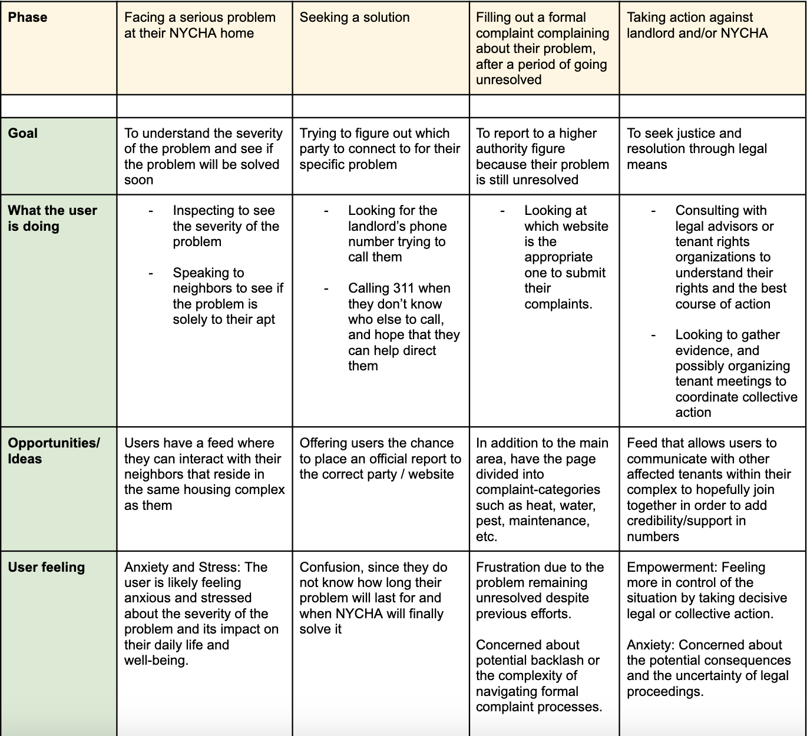

# TenantVoice
TenantVoice looks to empower public housing tenants in NYC to enforce accountability, fostering a collaborative environment that promotes sustained housing quality improvements.


**Table of Contents**


- [Authors](#authors)
- [The Problem](#the-problem)
- [Summary](#summary)
- [Our Hypothesis](#our-hypothesis)
- [Product Overview](#product-overview)
- [Who Do We Serve?](#who-do-we-serve?)
- [User Journey Map](#user-journey-map)
- [User-stories](#user-stories)
- [Key Technical Challenge](#key-technical-challenge)
- [Sources](#sources)


## Authors
Authors:
- Mohamed Sy
- Roe Cox
- Nicole Juarez-Flores


Team Name: Mo, Ro & Co.


## The Problem
Public housing complexes frequently face a variety of maintenance issues that are not addressed promptly or effectively, leading to rapidly deteriorating living conditions for residents. These conditions not only degrade the quality of life but also pose significant health risks. Currently, tenants lack a dedicated platform that enables them to publicly share and discuss these housing conditions. Furthermore, there is no efficient way for them to communicate collectively with neighbors across their housing complex to verify whether these issues have been consistently resolved or to mobilize for collective action.


## Summary
1 in 17 New Yorkers get provided public housing under the New York City Housing Authority (NYCHA). In recent years, the NYCHA has been named “New York City’s worst landlord”, with 200,000 complaints for bed bug and roach infestations in 2020, reports of elevator outages leaving disabled residents at home for days, and a report revealing that the NYCHA has been lying about the presence of lead in its developments. This lack of transparency and mismanagement on the part of the NYCHA negatively impacts the quality of life of hundreds of thousands of low-income residents in the city.


## Our Hypothesis
If NYCHA residents have the ability to report inadequate housing conditions, then they will be able to create and maintain a detailed record of poor living conditions that can be utilized in court to hold NYCHA and their landlords accountable.


## Product Overview
1. The product will allow users to post about their housing problems. Users will choose the category for the issue they are facing, and give a timeframe of how long this problem has been going on (in weeks).
>Given that there may be shame related to the issue, users will have a “username” in order to conceal their identity.


2. The product will display a data visual, detailing the magnitude of the issues that NYCHA users are currently facing
>Logged-in users will also have the ability to see the magnitude of the issues that users from the same housing complex as them are also facing.
>This will be displayed as either a pie chart, or bar chart.


3. The product will contain two feeds for our user to view from. One feed will be posts from users that also reside in the same housing complex as them. The second feed will be posts from residents of NYCHA. The layout will resemble how Twitter’s UI displays two feeds since it has a “For You” and “Following” page to click between.


## Who Do We Serve?
Our application serves low-income public housing tenants in NYC living under the New York City Housing Authority (NYCHA).


## User Journey Map
User Persona: Gina R.


- Age: 28
- Location: NYCHA Housing Complex, Brooklyn
- Occupation: Nurse
- Bio: Gina is a determined and proactive tenant who is frustrated with the persistent maintenance issues in her NYCHA housing complex. She juggles her job and caring for her grandmother, who suffers with mobility issues and relied on the elevator to get to the apartment, since they live in the 15th floor
- Problem: It is the middle of October and the weather is starting to get cooler. There is no heat in the apartment yet, and the elevator is constantly out of service





## User-stories
<b>User Story A:</b> <em>As a NYCHA resident of a public housing development, I can register to the site or log-in if I have already made an account.</em>
- A visitor can go to the ```/about/register``` page, where they find options to either register or log in
- Registration requires entering personal details and setting up credentials, while logging in requires existing credentials.


Tables needed:
- ```users``` - ```id*, email, password, full_name```


<b>User Story B:</b> <em>As a new user, I can set up my profile to personalize my experience and provide necessary details for better service.</em>


- After registering and logging in, a user can access their profile setup page from the ```/main``` endpoint.
- The profile setup allows the user to enter or update additional details such as their location and any specific preferences or requirements they have.


Tables needed:
- ```users``` - ```id*, email, password, full_name, username, location_id```
- ```location``` - ```id*, borough, neighborhood, complex```


<b>User Story C:</b> <em>As a visitor of the page, I can scroll through the NYCHA-Wide feed to see all posts by residents.</em>


- Each post will include the name of the complex where the issue occurs
- Each post will have a category, relating to the issue described in the post (such as heating, maintenance, mold, etc.)
- I can read posts, and click on a post to view more details


Tables needed:
- ```post``` - ```id*, user_id**, location_id**, category_id**, date, problem_duration, previously_reported, description, picture```
- ```location``` - ```id*, borough, neighborhood, complex, building```
- ```category``` - ```id*, name```


<b>User Story D:</b> <em>As a logged in user, in addition to seeing NYCHA-Wide posts, I have the ability to see posts related to the housing complex I live in.</em>


- I can read other users posts, and click on the post to view more details
- I can upvote other user’s reports


Tables needed:
- ```post``` - ```id*, user_id**, location_id**, category_id**, date, problem_duration, previously_reported, description, picture```
- ```location``` - ```id*, borough, neighborhood, complex, building```
- ```users``` - ```id*, email, password, full_name, username, location_id```
- ```upvote``` - ```id*, post_id**, user_id**```


<b>User Story E:</b> <em>As a logged in user, I have the ability to make posts.</em>


- Each post I make will be placed in the /main endpoint.
- I can attach the appropriate category that my post’s issue is about
- I can also delete my post


Tables needed:
- ```post``` - ```id*, user_id**, location_id**, category_id**, date, problem_duration, previously_reported, description, picture```
- ```location``` - ```id*, borough, neighborhood, complex, building```
- ```users``` - ```id*, email, password, full_name, username, location_id```
- ```upvote``` - ```id*, post_id**, user_id**```


## Key Technical Challenge


- <b>Class and Controller Design:</b> We need to refine our understanding and implementation of classes within our architecture to effectively manage the logic.


- <b>React Hooks:</b> Trying to better understand how data flows through forms using React Hooks, which is crucial for dynamic content management.


- <b>Responsive and Adaptive Design:</b> It's challenging to ensure the application is responsive and functions well across different devices and screen sizes, particularly when incorporating complex UI components. Also need to learn how to use a styling framework.


## Sources
https://nchh.org/who-we-are/mission/
https://www.nyc.gov/assets/nycha/downloads/pdf/NYCHA-Fact-Sheet-2023.pdf
https://gothamist.com/news/new-york-citys-worst-landlord-isnew-york-city 
https://www.cityandstateny.com/politics/2020/01/nychas-list-of-unresolved-issues-grows/176956/ 
